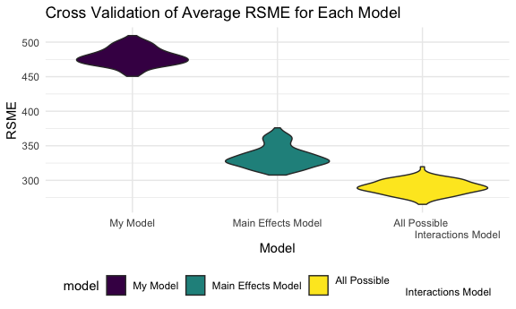

p8105\_hw6\_jf3354
================
Judy Fordjuoh
November 27, 2021

    ## ── Attaching packages ─────────────────────────────────────── tidyverse 1.3.1 ──

    ## ✓ ggplot2 3.3.5     ✓ purrr   0.3.4
    ## ✓ tibble  3.1.5     ✓ dplyr   1.0.7
    ## ✓ tidyr   1.1.3     ✓ stringr 1.4.0
    ## ✓ readr   2.0.1     ✓ forcats 0.5.1

    ## ── Conflicts ────────────────────────────────────────── tidyverse_conflicts() ──
    ## x dplyr::filter() masks stats::filter()
    ## x dplyr::lag()    masks stats::lag()

    ## Loading required package: nlme

    ## 
    ## Attaching package: 'nlme'

    ## The following object is masked from 'package:dplyr':
    ## 
    ##     collapse

    ## This is mgcv 1.8-38. For overview type 'help("mgcv-package")'.

## Question 1

``` r
#Load and clean the data for regression analysis (i.e. convert numeric to factor where appropriate, check for missing data, etc.

bw = 
    read_csv("birthweight.csv") %>% 
 janitor::clean_names() %>% 
  mutate(
    babysex = as.factor(babysex),
    malform = as.factor(malform),
    frace = as.factor(frace),
    mrace = as.factor(mrace)
  ) #all the other variables are continuous so we won't convert them
```

    ## Rows: 4342 Columns: 20

    ## ── Column specification ────────────────────────────────────────────────────────
    ## Delimiter: ","
    ## dbl (20): babysex, bhead, blength, bwt, delwt, fincome, frace, gaweeks, malf...

    ## 
    ## ℹ Use `spec()` to retrieve the full column specification for this data.
    ## ℹ Specify the column types or set `show_col_types = FALSE` to quiet this message.

``` r
#checking for NA's
purrr::map(bw, ~ sum(is.na(.)))
```

    ## $babysex
    ## [1] 0
    ## 
    ## $bhead
    ## [1] 0
    ## 
    ## $blength
    ## [1] 0
    ## 
    ## $bwt
    ## [1] 0
    ## 
    ## $delwt
    ## [1] 0
    ## 
    ## $fincome
    ## [1] 0
    ## 
    ## $frace
    ## [1] 0
    ## 
    ## $gaweeks
    ## [1] 0
    ## 
    ## $malform
    ## [1] 0
    ## 
    ## $menarche
    ## [1] 0
    ## 
    ## $mheight
    ## [1] 0
    ## 
    ## $momage
    ## [1] 0
    ## 
    ## $mrace
    ## [1] 0
    ## 
    ## $parity
    ## [1] 0
    ## 
    ## $pnumlbw
    ## [1] 0
    ## 
    ## $pnumsga
    ## [1] 0
    ## 
    ## $ppbmi
    ## [1] 0
    ## 
    ## $ppwt
    ## [1] 0
    ## 
    ## $smoken
    ## [1] 0
    ## 
    ## $wtgain
    ## [1] 0

\#For my model I included risk factors that I have learned in previous
classes have have an affect on birthweight of a child, specifically
contributing to low birthweight. In terms of behavioral risk factors, I
included smoken because maternal smoking during pregnancy and the
smoking intensity has been consistently related to low birthweight. In
terms of preganncy specific factors, I included the mothers age at
delivry(momage), the mothers weight at the delivery(delwt), mother’s
weight gain during pregnancy(wtgain), presence of
malformations(malform), number of live births prior to this
pregancy(parity), and previous number of low birth weight babies
(pnumlbw) into the model. I also added an interaction model between
mother’s weight at delivery and weight bain during pregnanacy as they
are dependent on each other.

``` r
#Propose a regression model for birthweight. This model may be based on a hypothesized structure for the factors that underly birthweight, on a data-driven model-building process, or a combination of the two. Describe your modeling process and show a plot of model residuals against fitted values – use add_predictions and add_residuals in making this plot.

fitted_model_1 = lm(bwt ~ smoken + momage + delwt + wtgain + malform + parity + pnumlbw + delwt*wtgain, data = bw)

summary(fitted_model_1)
```

    ## 
    ## Call:
    ## lm(formula = bwt ~ smoken + momage + delwt + wtgain + malform + 
    ##     parity + pnumlbw + delwt * wtgain, data = bw)
    ## 
    ## Residuals:
    ##      Min       1Q   Median       3Q      Max 
    ## -2519.24  -275.34    15.33   308.80  1515.19 
    ## 
    ## Coefficients: (1 not defined because of singularities)
    ##                Estimate Std. Error t value Pr(>|t|)    
    ## (Intercept)  1444.22859   91.71250  15.747  < 2e-16 ***
    ## smoken         -7.06617    0.97944  -7.215 6.36e-13 ***
    ## momage         18.86277    1.89304   9.964  < 2e-16 ***
    ## delwt           7.63810    0.58595  13.035  < 2e-16 ***
    ## wtgain         27.81241    3.26115   8.528  < 2e-16 ***
    ## malform1      -48.73460  123.22611  -0.395    0.693    
    ## parity        -91.36823   70.30186  -1.300    0.194    
    ## pnumlbw              NA         NA      NA       NA    
    ## delwt:wtgain   -0.12331    0.01996  -6.179 7.06e-10 ***
    ## ---
    ## Signif. codes:  0 '***' 0.001 '**' 0.01 '*' 0.05 '.' 0.1 ' ' 1
    ## 
    ## Residual standard error: 475.9 on 4334 degrees of freedom
    ## Multiple R-squared:  0.1381, Adjusted R-squared:  0.1367 
    ## F-statistic: 99.18 on 7 and 4334 DF,  p-value: < 2.2e-16

``` r
bw %>% 
  modelr::add_residuals(fitted_model_1) %>%
  modelr::add_predictions(fitted_model_1) %>% 
  ggplot(aes(x = pred, y = resid)) + 
  geom_point(alpha = 0.3) +
  geom_smooth(se = TRUE, color = "red", method = "lm") +
  labs(
    title = "Predicted vs. Residuals",
    x = "Predicted",
    y = "Residuals") +
  theme(plot.title = element_text(hjust = 0.5))
```

    ## Warning in predict.lm(model, data): prediction from a rank-deficient fit may be
    ## misleading

    ## Warning in predict.lm(model, data): prediction from a rank-deficient fit may be
    ## misleading

    ## `geom_smooth()` using formula 'y ~ x'


\# Prediction values seem to be concentrated between 2750 and 3500 while
the residual values seem to aggregate between -1000 and 900. Now we will
compared our model to two other models: 1. one predicting birth weight
using length at birth baby and gestational age as the only main effects
and 2.head circumference, length at birth baby, sex, and all
interactions beteween these 3 variables to predict birth weight.

``` r
#Model 1: only baby length and gestational age
provided_model1 = lm(bwt~ blength + gaweeks, data = bw) 
summary(provided_model1)
```

    ## 
    ## Call:
    ## lm(formula = bwt ~ blength + gaweeks, data = bw)
    ## 
    ## Residuals:
    ##     Min      1Q  Median      3Q     Max 
    ## -1709.6  -215.4   -11.4   208.2  4188.8 
    ## 
    ## Coefficients:
    ##              Estimate Std. Error t value Pr(>|t|)    
    ## (Intercept) -4347.667     97.958  -44.38   <2e-16 ***
    ## blength       128.556      1.990   64.60   <2e-16 ***
    ## gaweeks        27.047      1.718   15.74   <2e-16 ***
    ## ---
    ## Signif. codes:  0 '***' 0.001 '**' 0.01 '*' 0.05 '.' 0.1 ' ' 1
    ## 
    ## Residual standard error: 333.2 on 4339 degrees of freedom
    ## Multiple R-squared:  0.5769, Adjusted R-squared:  0.5767 
    ## F-statistic:  2958 on 2 and 4339 DF,  p-value: < 2.2e-16

``` r
bw %>% 
  modelr::add_residuals(provided_model1) %>% 
  modelr::add_predictions(provided_model1) %>%
  ggplot(aes(x = pred, y = resid)) + 
  geom_point(alpha = .3) +
  labs(
    title = "Model 1: Body Length and Gestational Age Main Effects Only",
    x = "Predictions",
    y = "Residuals") +
  theme(plot.title = element_text(hjust = 0.5))
```


``` r
#Model 2: head circumference, length at birth baby, sex, and all interactions
provided_model2 = lm(bwt~ blength + babysex + bhead + blength*babysex*bhead + blength*babysex + blength*bhead + babysex*bhead, data = bw) 
summary(provided_model2)
```

    ## 
    ## Call:
    ## lm(formula = bwt ~ blength + babysex + bhead + blength * babysex * 
    ##     bhead + blength * babysex + blength * bhead + babysex * bhead, 
    ##     data = bw)
    ## 
    ## Residuals:
    ##      Min       1Q   Median       3Q      Max 
    ## -1132.99  -190.42   -10.33   178.63  2617.96 
    ## 
    ## Coefficients:
    ##                          Estimate Std. Error t value Pr(>|t|)    
    ## (Intercept)            -7176.8170  1264.8397  -5.674 1.49e-08 ***
    ## blength                  102.1269    26.2118   3.896 9.92e-05 ***
    ## babysex2                6374.8684  1677.7669   3.800 0.000147 ***
    ## bhead                    181.7956    38.0542   4.777 1.84e-06 ***
    ## blength:babysex2        -123.7729    35.1185  -3.524 0.000429 ***
    ## blength:bhead             -0.5536     0.7802  -0.710 0.478012    
    ## babysex2:bhead          -198.3932    51.0917  -3.883 0.000105 ***
    ## blength:babysex2:bhead     3.8781     1.0566   3.670 0.000245 ***
    ## ---
    ## Signif. codes:  0 '***' 0.001 '**' 0.01 '*' 0.05 '.' 0.1 ' ' 1
    ## 
    ## Residual standard error: 287.7 on 4334 degrees of freedom
    ## Multiple R-squared:  0.6849, Adjusted R-squared:  0.6844 
    ## F-statistic:  1346 on 7 and 4334 DF,  p-value: < 2.2e-16

``` r
bw %>% 
  modelr::add_residuals(provided_model2) %>% 
  modelr::add_predictions(provided_model2) %>%
  ggplot(aes(x = pred, y = resid)) + 
  geom_point(alpha = .3) +
  labs(
    title = "Model 2: Body Length, Head Circumference, 
    Baby Sex, and All Possible Interactions",
    x = "Predictions",
    y = "Residuals") +
  theme(plot.title = element_text(hjust = 0.5))
```


``` r
#Make this comparison in terms of the cross-validated prediction error; use crossv_mc and functions in purrr as appropriate.
cv_df =
  crossv_mc(bw, 100)

cv_df %>% pull(train) %>% .[[1]] %>% as_tibble
```

    ## # A tibble: 3,473 × 20
    ##    babysex bhead blength   bwt delwt fincome frace gaweeks malform menarche
    ##    <fct>   <dbl>   <dbl> <dbl> <dbl>   <dbl> <fct>   <dbl> <fct>      <dbl>
    ##  1 1          34      48  3062   156      65 2        25.9 0             14
    ##  2 2          36      50  3345   148      85 1        39.9 0             12
    ##  3 2          34      52  3374   156       5 1        41.6 0             13
    ##  4 2          33      46  2523   126      96 2        40.3 0             14
    ##  5 2          33      49  2778   140       5 1        37.4 0             12
    ##  6 1          36      52  3515   146      85 1        40.3 0             11
    ##  7 1          33      50  3459   169      75 2        40.7 0             12
    ##  8 1          35      51  3459   146      55 1        39.4 0             12
    ##  9 1          36      53  3629   147      75 1        41.3 0             11
    ## 10 1          35      51  3544   129      65 1        39.6 0             12
    ## # … with 3,463 more rows, and 10 more variables: mheight <dbl>, momage <dbl>,
    ## #   mrace <fct>, parity <dbl>, pnumlbw <dbl>, pnumsga <dbl>, ppbmi <dbl>,
    ## #   ppwt <dbl>, smoken <dbl>, wtgain <dbl>

``` r
cv_df %>% pull(test) %>% .[[1]] %>% as_tibble
```

    ## # A tibble: 869 × 20
    ##    babysex bhead blength   bwt delwt fincome frace gaweeks malform menarche
    ##    <fct>   <dbl>   <dbl> <dbl> <dbl>   <dbl> <fct>   <dbl> <fct>      <dbl>
    ##  1 2          34      51  3629   177      35 1        39.9 0             13
    ##  2 1          34      52  3062   157      55 1        40   0             14
    ##  3 1          33      52  3374   129      55 1        40.7 0             12
    ##  4 2          35      51  3317   130      55 1        43.4 0             13
    ##  5 2          35      48  3175   158      75 1        39.7 0             13
    ##  6 1          35      56  3232   147      55 1        42.1 0             13
    ##  7 2          35      51  3827   130      45 1        41.3 0             12
    ##  8 2          34      51  3232   155      55 1        41.6 0             15
    ##  9 2          34      51  3175   142      96 1        42.3 0             17
    ## 10 1          33      51  3345   140      85 1        38.6 0             13
    ## # … with 859 more rows, and 10 more variables: mheight <dbl>, momage <dbl>,
    ## #   mrace <fct>, parity <dbl>, pnumlbw <dbl>, pnumsga <dbl>, ppbmi <dbl>,
    ## #   ppwt <dbl>, smoken <dbl>, wtgain <dbl>

``` r
cv_df =
  cv_df %>% 
  mutate(
    train = map(train, as_tibble),
    test = map(test, as_tibble)) 

#Now I have my testing and training datasets and have to fit my models and obtain the RMSEs using mutate + map

cv_df = 
  cv_df %>% 
  mutate(
    fitted_model_1  = map(train, ~lm(bwt ~ smoken + momage + delwt + wtgain + malform + parity + pnumlbw + delwt*wtgain, data = .x)),
    provided_model1  = map(train, ~lm(bwt~ blength + gaweeks, data = .x)),
    provided_model2  = map(train, ~lm(bwt~ blength + babysex + bhead + blength*babysex*bhead + blength*babysex + blength*bhead + babysex*bhead, data = .x))) %>% 
mutate(
    rmse_1 = map2_dbl(fitted_model_1, test, ~rmse(model = .x, data = .y)),
    rmse_2 = map2_dbl(provided_model1, test, ~rmse(model = .x, data = .y)),
    rmse_3 = map2_dbl(provided_model2, test, ~rmse(model = .x, data = .y)))
```

    ## Warning in predict.lm(model, data): prediction from a rank-deficient fit may be
    ## misleading

    ## Warning in predict.lm(model, data): prediction from a rank-deficient fit may be
    ## misleading

    ## Warning in predict.lm(model, data): prediction from a rank-deficient fit may be
    ## misleading

    ## Warning in predict.lm(model, data): prediction from a rank-deficient fit may be
    ## misleading

    ## Warning in predict.lm(model, data): prediction from a rank-deficient fit may be
    ## misleading

    ## Warning in predict.lm(model, data): prediction from a rank-deficient fit may be
    ## misleading

    ## Warning in predict.lm(model, data): prediction from a rank-deficient fit may be
    ## misleading

    ## Warning in predict.lm(model, data): prediction from a rank-deficient fit may be
    ## misleading

    ## Warning in predict.lm(model, data): prediction from a rank-deficient fit may be
    ## misleading

    ## Warning in predict.lm(model, data): prediction from a rank-deficient fit may be
    ## misleading

    ## Warning in predict.lm(model, data): prediction from a rank-deficient fit may be
    ## misleading

    ## Warning in predict.lm(model, data): prediction from a rank-deficient fit may be
    ## misleading

    ## Warning in predict.lm(model, data): prediction from a rank-deficient fit may be
    ## misleading

    ## Warning in predict.lm(model, data): prediction from a rank-deficient fit may be
    ## misleading

    ## Warning in predict.lm(model, data): prediction from a rank-deficient fit may be
    ## misleading

    ## Warning in predict.lm(model, data): prediction from a rank-deficient fit may be
    ## misleading

    ## Warning in predict.lm(model, data): prediction from a rank-deficient fit may be
    ## misleading

    ## Warning in predict.lm(model, data): prediction from a rank-deficient fit may be
    ## misleading

    ## Warning in predict.lm(model, data): prediction from a rank-deficient fit may be
    ## misleading

    ## Warning in predict.lm(model, data): prediction from a rank-deficient fit may be
    ## misleading

    ## Warning in predict.lm(model, data): prediction from a rank-deficient fit may be
    ## misleading

    ## Warning in predict.lm(model, data): prediction from a rank-deficient fit may be
    ## misleading

    ## Warning in predict.lm(model, data): prediction from a rank-deficient fit may be
    ## misleading

    ## Warning in predict.lm(model, data): prediction from a rank-deficient fit may be
    ## misleading

    ## Warning in predict.lm(model, data): prediction from a rank-deficient fit may be
    ## misleading

    ## Warning in predict.lm(model, data): prediction from a rank-deficient fit may be
    ## misleading

    ## Warning in predict.lm(model, data): prediction from a rank-deficient fit may be
    ## misleading

    ## Warning in predict.lm(model, data): prediction from a rank-deficient fit may be
    ## misleading

    ## Warning in predict.lm(model, data): prediction from a rank-deficient fit may be
    ## misleading

    ## Warning in predict.lm(model, data): prediction from a rank-deficient fit may be
    ## misleading

    ## Warning in predict.lm(model, data): prediction from a rank-deficient fit may be
    ## misleading

    ## Warning in predict.lm(model, data): prediction from a rank-deficient fit may be
    ## misleading

    ## Warning in predict.lm(model, data): prediction from a rank-deficient fit may be
    ## misleading

    ## Warning in predict.lm(model, data): prediction from a rank-deficient fit may be
    ## misleading

    ## Warning in predict.lm(model, data): prediction from a rank-deficient fit may be
    ## misleading

    ## Warning in predict.lm(model, data): prediction from a rank-deficient fit may be
    ## misleading

    ## Warning in predict.lm(model, data): prediction from a rank-deficient fit may be
    ## misleading

    ## Warning in predict.lm(model, data): prediction from a rank-deficient fit may be
    ## misleading

    ## Warning in predict.lm(model, data): prediction from a rank-deficient fit may be
    ## misleading

    ## Warning in predict.lm(model, data): prediction from a rank-deficient fit may be
    ## misleading

    ## Warning in predict.lm(model, data): prediction from a rank-deficient fit may be
    ## misleading

    ## Warning in predict.lm(model, data): prediction from a rank-deficient fit may be
    ## misleading

    ## Warning in predict.lm(model, data): prediction from a rank-deficient fit may be
    ## misleading

    ## Warning in predict.lm(model, data): prediction from a rank-deficient fit may be
    ## misleading

    ## Warning in predict.lm(model, data): prediction from a rank-deficient fit may be
    ## misleading

    ## Warning in predict.lm(model, data): prediction from a rank-deficient fit may be
    ## misleading

    ## Warning in predict.lm(model, data): prediction from a rank-deficient fit may be
    ## misleading

    ## Warning in predict.lm(model, data): prediction from a rank-deficient fit may be
    ## misleading

    ## Warning in predict.lm(model, data): prediction from a rank-deficient fit may be
    ## misleading

    ## Warning in predict.lm(model, data): prediction from a rank-deficient fit may be
    ## misleading

    ## Warning in predict.lm(model, data): prediction from a rank-deficient fit may be
    ## misleading

    ## Warning in predict.lm(model, data): prediction from a rank-deficient fit may be
    ## misleading

    ## Warning in predict.lm(model, data): prediction from a rank-deficient fit may be
    ## misleading

    ## Warning in predict.lm(model, data): prediction from a rank-deficient fit may be
    ## misleading

    ## Warning in predict.lm(model, data): prediction from a rank-deficient fit may be
    ## misleading

    ## Warning in predict.lm(model, data): prediction from a rank-deficient fit may be
    ## misleading

    ## Warning in predict.lm(model, data): prediction from a rank-deficient fit may be
    ## misleading

    ## Warning in predict.lm(model, data): prediction from a rank-deficient fit may be
    ## misleading

    ## Warning in predict.lm(model, data): prediction from a rank-deficient fit may be
    ## misleading

    ## Warning in predict.lm(model, data): prediction from a rank-deficient fit may be
    ## misleading

    ## Warning in predict.lm(model, data): prediction from a rank-deficient fit may be
    ## misleading

    ## Warning in predict.lm(model, data): prediction from a rank-deficient fit may be
    ## misleading

    ## Warning in predict.lm(model, data): prediction from a rank-deficient fit may be
    ## misleading

    ## Warning in predict.lm(model, data): prediction from a rank-deficient fit may be
    ## misleading

    ## Warning in predict.lm(model, data): prediction from a rank-deficient fit may be
    ## misleading

    ## Warning in predict.lm(model, data): prediction from a rank-deficient fit may be
    ## misleading

    ## Warning in predict.lm(model, data): prediction from a rank-deficient fit may be
    ## misleading

    ## Warning in predict.lm(model, data): prediction from a rank-deficient fit may be
    ## misleading

    ## Warning in predict.lm(model, data): prediction from a rank-deficient fit may be
    ## misleading

    ## Warning in predict.lm(model, data): prediction from a rank-deficient fit may be
    ## misleading

    ## Warning in predict.lm(model, data): prediction from a rank-deficient fit may be
    ## misleading

    ## Warning in predict.lm(model, data): prediction from a rank-deficient fit may be
    ## misleading

    ## Warning in predict.lm(model, data): prediction from a rank-deficient fit may be
    ## misleading

    ## Warning in predict.lm(model, data): prediction from a rank-deficient fit may be
    ## misleading

    ## Warning in predict.lm(model, data): prediction from a rank-deficient fit may be
    ## misleading

    ## Warning in predict.lm(model, data): prediction from a rank-deficient fit may be
    ## misleading

    ## Warning in predict.lm(model, data): prediction from a rank-deficient fit may be
    ## misleading

    ## Warning in predict.lm(model, data): prediction from a rank-deficient fit may be
    ## misleading

    ## Warning in predict.lm(model, data): prediction from a rank-deficient fit may be
    ## misleading

    ## Warning in predict.lm(model, data): prediction from a rank-deficient fit may be
    ## misleading

    ## Warning in predict.lm(model, data): prediction from a rank-deficient fit may be
    ## misleading

    ## Warning in predict.lm(model, data): prediction from a rank-deficient fit may be
    ## misleading

    ## Warning in predict.lm(model, data): prediction from a rank-deficient fit may be
    ## misleading

    ## Warning in predict.lm(model, data): prediction from a rank-deficient fit may be
    ## misleading

    ## Warning in predict.lm(model, data): prediction from a rank-deficient fit may be
    ## misleading

    ## Warning in predict.lm(model, data): prediction from a rank-deficient fit may be
    ## misleading

    ## Warning in predict.lm(model, data): prediction from a rank-deficient fit may be
    ## misleading

    ## Warning in predict.lm(model, data): prediction from a rank-deficient fit may be
    ## misleading

    ## Warning in predict.lm(model, data): prediction from a rank-deficient fit may be
    ## misleading

    ## Warning in predict.lm(model, data): prediction from a rank-deficient fit may be
    ## misleading

    ## Warning in predict.lm(model, data): prediction from a rank-deficient fit may be
    ## misleading

    ## Warning in predict.lm(model, data): prediction from a rank-deficient fit may be
    ## misleading

    ## Warning in predict.lm(model, data): prediction from a rank-deficient fit may be
    ## misleading

    ## Warning in predict.lm(model, data): prediction from a rank-deficient fit may be
    ## misleading

    ## Warning in predict.lm(model, data): prediction from a rank-deficient fit may be
    ## misleading

    ## Warning in predict.lm(model, data): prediction from a rank-deficient fit may be
    ## misleading

    ## Warning in predict.lm(model, data): prediction from a rank-deficient fit may be
    ## misleading

    ## Warning in predict.lm(model, data): prediction from a rank-deficient fit may be
    ## misleading

    ## Warning in predict.lm(model, data): prediction from a rank-deficient fit may be
    ## misleading

    ## Warning in predict.lm(model, data): prediction from a rank-deficient fit may be
    ## misleading

``` r
cv_df %>% 
  select(starts_with("rmse")) %>% 
  pivot_longer(
    everything(),
    names_to = "model", 
    values_to = "rmse",
    names_prefix = "rmse_") %>% 
  mutate(model = fct_inorder(model)) %>% 
  mutate(model = recode(model,
                        "1" = "My Model",
                        "2" = "Main Effects Model",
                        "3" = "All Possible 
                        Interactions Model")) %>%
  ggplot(aes(x = model, y = rmse, fill = model)) + 
  geom_violin() +
  labs(
    title = "Cross Validation of Average RSME for Each Model",
    x = "Model",
    y = "RSME"
  ) 
```



\#We can see that my model has the highest RMSE on average making it the
worst predictor model out of the 3 discussed. The all possible
interactions model has the lowest RMSE on average making it the best
predictor model out of the 3. The distribution of my model’s violin plot
has a similar shape to the main effects model except mine is wider and
stumpy. If I would redo this, I would maybe reduce the amount of
variables in the model and include more interaction terms because there
is some form of dependence on other variables or effect modifiying for
some variables.

## Question 2

``` r
#Code from the website
weather_df = 
  rnoaa::meteo_pull_monitors(
    c("USW00094728"),
    var = c("PRCP", "TMIN", "TMAX"), 
    date_min = "2017-01-01",
    date_max = "2017-12-31") %>%
  mutate(
    name = recode(id, USW00094728 = "CentralPark_NY"),
    tmin = tmin / 10,
    tmax = tmax / 10) %>%
  select(name, id, everything())
```

    ## Registered S3 method overwritten by 'hoardr':
    ##   method           from
    ##   print.cache_info httr

    ## using cached file: ~/Library/Caches/R/noaa_ghcnd/USW00094728.dly

    ## date created (size, mb): 2021-11-27 10:40:06 (7.614)

    ## file min/max dates: 1869-01-01 / 2021-11-30

``` r
#We are doing a simple linear regression with tmax as the response and tmin as the predictor

#Use 5000 bootstrap samples and, for each bootstrap sample, produce estimates of these two quantities (the r squared and the log(beta0*beta1)). Plot the distribution of your estimates, and describe these in words.

#writing function    
sample = function(df) {
  sample_frac(df, replace = TRUE)
}

#from bootstrapping lecture
boot_straps = 
  data_frame(
    strap_number = 1:5000,
    sample = rerun(5000, sample(weather_df))
  )
```

    ## Warning: `data_frame()` was deprecated in tibble 1.1.0.
    ## Please use `tibble()` instead.
    ## This warning is displayed once every 8 hours.
    ## Call `lifecycle::last_lifecycle_warnings()` to see where this warning was generated.

``` r
#ANALYZING R SQUARED
bootstraps_results = 
  boot_straps %>%
  mutate(
    models = map(.x = sample, ~lm(tmax ~ tmin, data = .x)),
    results_1 = map(models, broom::glance) #rsquare 
    ) %>%
  select(strap_number, results_1) %>% 
  unnest(results_1)

bootstraps_results %>%
  ggplot(aes(x = adj.r.squared)) +
  geom_density() +
  labs(
        title = "Distribution of the Adjusted R Squared",
        x = "R Squared",
        y = "Density" 
    ) +
  theme(plot.title = element_text(hjust = 0.5))
```


``` r
#95% confidence intervals
bootstraps_results %>% 
  pull(adj.r.squared) %>% 
  quantile(c(0.025, 0.975))
```

    ##      2.5%     97.5% 
    ## 0.8936668 0.9271394

\#From the plot of adjusted R square, we can see that its distribution
looks like a normal distribution, with the highest peaks around
0.911-0.912.The 95% CI of adjusted R square is: (0.895-0.927).

``` r
#ANALYZING log(beta0*beta1)

bootstrap_results2 =
  boot_straps %>% 
  mutate(
    models = map(sample, ~lm(tmax ~ tmin, data = .x) ),
    results = map(models, broom::tidy)) %>% 
select(strap_number, results) %>% #still in list form
  unnest(results) %>% #flattens it back out into regular columns
  select(term, estimate) %>% 
  pivot_wider(
    names_from = term,
    values_from = estimate
  ) %>% #there is an intercept and tmin column but everything is squisjed so unnest it
  unnest(cols = c(`(Intercept)`, tmin)) %>% #flattens it back out into regular columns
  rename(
    beta_0 = "(Intercept)",
    beta_1 = tmin
  ) %>% 
 mutate(
    log_function = log(beta_0*beta_1)
  )
```

    ## Warning: Values are not uniquely identified; output will contain list-cols.
    ## * Use `values_fn = list` to suppress this warning.
    ## * Use `values_fn = length` to identify where the duplicates arise
    ## * Use `values_fn = {summary_fun}` to summarise duplicates

``` r
bootstrap_results2 %>%
  ggplot(aes(x = log_function)) +
  geom_density() +
  labs(
        title = "Distribution of Log(Beta0*Beta1)",
        x = "Log(Beta0*Beta1)",
        y = "Density" 
    ) +
  theme(plot.title = element_text(hjust = 0.5))
```


``` r
#95% confidence intervals
bootstrap_results2 %>% 
  pull(log_function) %>% 
  quantile(c(0.025, 0.975))
```

    ##     2.5%    97.5% 
    ## 1.963774 2.059037

\#From the plot of the distrubution of log(beta0*beta1), we can see that
the distribution of the log is normal distribution, with the highest
peaks around 2.015-2.020. The 95% CI of log(beta0*beta1) is:
(1.964-2.058).
